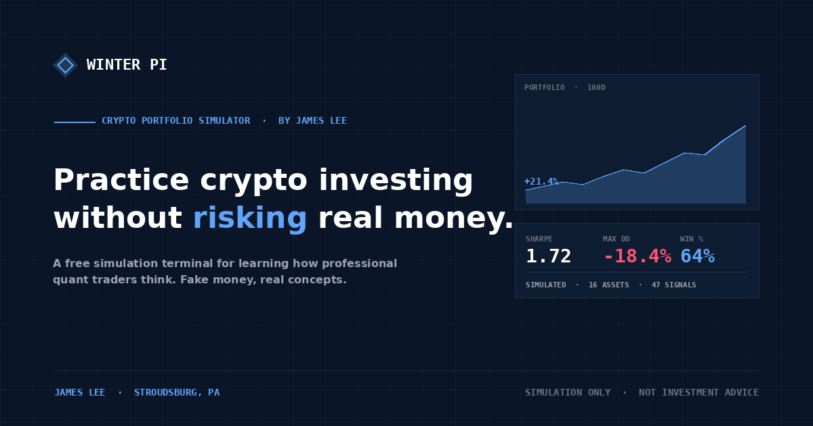

# Winter Pi

> A fully interactive crypto paper-trading simulator. Built by **James Lee** (Stroudsburg, PA).

**Live demo:** https://winter-pi.vercel.app *(update after deploying)*



---

## What it does

Winter Pi is a free crypto **paper trading** simulator. You start with $100,000 in fake money and buy/sell 16 crypto assets whose prices drift realistically in real time. Everything is fake — no API connections, no real markets — but the mechanics (cost basis, realized PnL, journal entries) work like the real thing.

Built as a portfolio piece demonstrating modern frontend engineering, state management, and data-first UX design.

## What's interactive

- **Buy and sell modal** — realistic quantity input with MAX / 25% / 50% / 75% shortcuts, cost preview, cash validation
- **Live drifting prices** — every asset's price updates every 3 seconds using a seeded random walk proportional to its realized volatility
- **Auto-journaled trades** — every buy/sell creates a journal entry with timestamp, realized PnL, and your typed reasoning
- **Portfolio saves to your browser** — close the tab, come back later, your positions are still there (uses `localStorage`)
- **Reset button** — wipe everything and start fresh with $100K any time
- **Live NAV in the nav bar** — portfolio value ticks up and down as prices move

## Pages

- **Dashboard** — live equity curve, top momentum picks (click to buy), recent trades, market regime
- **Portfolio** — open positions with live PnL, sell button on every row, realized/unrealized split
- **Trade** — full asset browser with live prices, search, filters, big Buy/Sell buttons
- **Strategy Lab** — pre-built strategies with historical backtest curves
- **Journal** — every trade ever made, with your reasoning and the PnL outcome

## Tech

Next.js 14 · React 18 · TypeScript · Tailwind CSS · Recharts · Lucide icons · `localStorage` persistence

All application code in `app/page.tsx`. Mock data + drift engine are isolated so a real market-data feed (CoinGecko, Kaiko, Coinbase) can swap in later.

## Running locally

```bash
npm install
npm run dev
```

Open [http://localhost:3000](http://localhost:3000).

## About

**James Lee** — Stroudsburg, PA. Self-taught developer exploring quantitative finance and frontend engineering.

[LinkedIn](https://linkedin.com/in/YOUR_HANDLE) · [GitHub](https://github.com/winterpls)

## Disclaimer

Winter Pi is a **simulation**. Every price, signal, and market event is fake — generated by a local drift algorithm. Not tracking real crypto markets. Not investment advice. Not affiliated with any exchange.

## License

MIT
